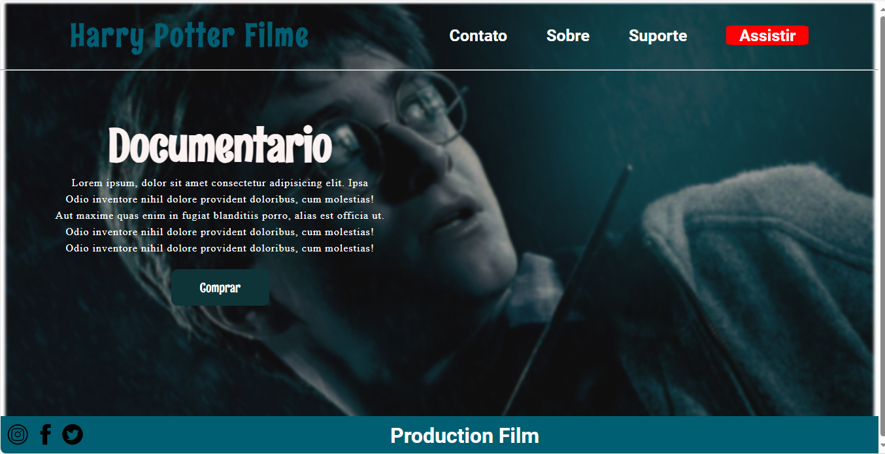

 <h1 align="center">
  💻 Portfólio - Raphael França
</h1>

<h4 align="center"><a href="https://raphaelff.github.io/PORTFOLIO/">Clique para visitar o projeto</a></h4>

## 📚 Seções

O site é composto por cinco seções:

- **Contato:** apenas inlustrativo;
- **Sobre:** A ideia nessa seção é fazer uma descrição dizendo um pouco sobre o filme;
- **Suporte:** Apenas inlustrativo;
- **Assistir:** Apenas inlustrativo;

---

## 💼 Tecnologias utilizadas

Para o desenvolvimento deste site utilizei as seguintes tecnologias:

- HTML - componentes;
   - Header;
   - Div;
   - Class;
   - Links;
   - Footer;
  
- CSS - componentes;
   Imagem como background;
   Fontes;
   Alinhamento com o display flex;
   Efeito com o hover;

---

<h2>🦄 Autor</h2>

<table>
  <tr>
    <td align="center">
      <a href="https://github.com/iuricode">
         
        
          <b>Raphael França</b>
        
      </a>
    </td>
  </tr>
</table>
